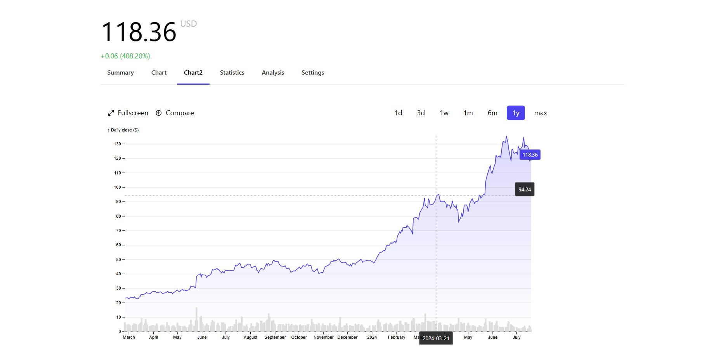

# D3.js Stock Data Chart
This is a simple D3.js chart that displays stock data. The data is loaded from an API and displayed as a area and bar chart. The chart also includes a tooltip that displays the stock price when the user hovers over the data points.

  

## Tech Stack Used
- React
- D3.js
- Rechart
- Financial Modelling Prep API (for Stock Data)

## Features
- Fetches stock data from the API
- Used D3.js and Recharts to display the stock data
- Can change the stock data time range (1D, 1W, 1M, 3M, 1Y, 5Y)
- Displays the stock data as a area (close price) and bar chart (volumes)
- CrossHair to display the stock price according to dates when the user hovers over chart
- Tooltip to display the current stock price 

## Installation
- Clone the repository
- Run `npm install` to install the dependencies
- Run `npm run dev` to start the development server